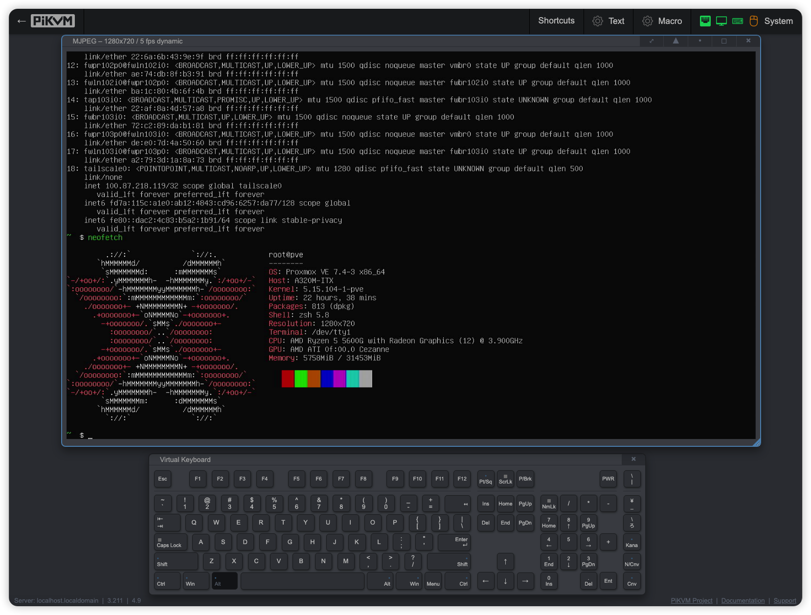

# pikvm-orangepizero2



[Images](https://drive.google.com/open?id=1bOtd9FwgLO2Cj4SauVdK410bDGqvtwhP&usp=drive_copy)

- First Boot

```shell
apt update && sync && apt -y upgrade
apt -y install avahi-daemon git curl wget ntp
mv /boot/dtb/allwinner/sun50i-h616-orangepi-zero2.dtb /boot/dtb/allwinner/sun50i-h616-orangepi-zero2.dtb.bak
wget http://www.industrie-optimierer.ch/tmp/PiKVM/PiKVM_OrangePizero2/sun50i-h616-orangepi-zero2.dtb -O /boot/dtb/allwinner/sun50i-h616-orangepi-zero2.dtb
sync && reboot
```

- Second Boot

> Don't use Custom Patches, say N !!!
  
```shell
git clone https://github.com/xe5700/kvmd-armbian.git
cd kvmd-armbian
mv install.sh install.sh.bak
mv config.sh config.sh.bak
wget http://www.industrie-optimierer.ch/tmp/PiKVM/PiKVM_OrangePizero2/install.sh
wget http://www.industrie-optimierer.ch/tmp/PiKVM/PiKVM_OrangePizero2/config.sh
chmod +x install.sh
./install.sh
```

- Third Boot

```shell
cd kvmd-armbian
./install.sh
```

- Mass Storage Drive

You can add a USB-Stick with sda1 ext4 an add in /etc/fstab this line:
/dev/sda1  /var/lib/kvmd/msd   ext4  nodev,nosuid,noexec,ro,errors=remount-ro,data=journal,X-kvmd.otgmsd-root=/var/lib/kvmd/msd,X-kvmd.otgmsd-user=kvmd  0  0

```yaml
and in /etc/kvmd/override.yaml (deacitvate #msd type):
    hid:
        mouse_alt:
            device: /dev/kvmd-hid-mouse-alt  # allow absolute/relative mouse mode
    msd:
        type: disabled
.
.
```

save and then... reboot

Or you resize the sdcard, und make there a second ext4 partiton for MSD (with sudo gparted, must be unmounted for that, but i don't explain detailed here)

- Change kvmd User Password

Only in a Terminal:
And change the password: kvmd-htpasswd set admin, or new user kvmd-htpasswd set NewUserName
